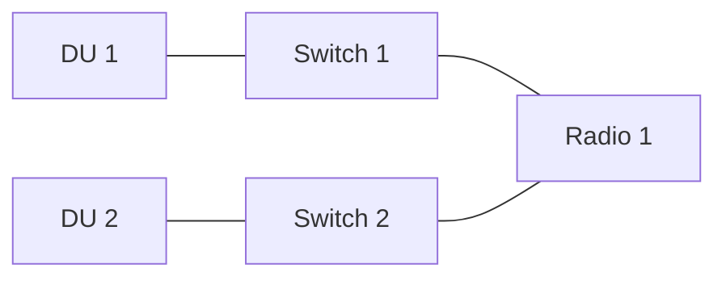

# Configuration Matrices - Combinatorics Summary

## Premise

Let us say that we want a matrix representing the amount of units we have of different types. If the first column represents a DU type, the second column represents a switch type (here denoted as "X" or "s"), and the third column represents a radio type. Then the matrix might look

$$\begin{array}{c c c} 
   d_1 & X & r_1 \\ 
   1 & 1 & 1 \\ 
   2 & 2 & 2 \\ 
   3 & 3 & 3 
\end{array}$$

But let us now put up a number of requirements:
* We must **always** have at least 1 DU. Otherwise nothing can handle traffic.
* We can **never have more switches than radios**
    * The switches are reduntant then, they do not add a benefit to the configuration but only adds unnecessary complexity. Should be removed.
    * Every configuration topology should end in a radio. If there are more switches than radios, then we can have "dangling switches".
* We can have zero switches. We can never have zero DUs or radios in total.
* We have an upper limit for the number of radios a configuration can have, a maximum. Let us denote this as $M$. It is probably in the range 40-100.
    * Among other things, it is limited by number of ports, port types, how many switches there are etc.
* If we have multiple types of radios, we must in a matrix always have at least 1 of each.
    * If there are zero of one type, then that should be represented in another smaller matrix, where the type was excluded all together.

To show how this will be represented.

If we have 1 DU, 0-2 switches (bounded by how many radios), and 1-2 radios. We can have the following sets.

$$\begin{array}{ccc} 
d_1 & X & r_1 \\ 
   1 & 0 & 1 \\ 
   1 & 0 & 2 \\ 
   1 & 1 & 1 \\ 
   1 & 1 & 2 \\ 
   1 & 2 & 2
\end{array}$$

As we can see there is no $(1\: 2\: 1)$ set, since we cannot have more switches than radios.

### Derivation of number of sets
The maximum number of radios we can have in a configuration is $M$. The amount of radio types we have within the configuration is denoted with $k$.

Let $R = r_1 + r_2 + \ldots + r_k$, represent the total number of radios, where $r_i$ ($1\leq i\leq k$) represents how many we have of a specific type of radio. Where $R$ ranges from $k$ to $M$ since we must have at least 1 of each radio type (and there are $k$ amount of types).

For a given number of radios $R$, but only 1 DU type and 1 switch type allowed:
- $\binom{R-1}{k-1}$ ways to distribute $R$ radios among $k$ types (each $\geq 1$) — stars and bars
- $R + 1$ choices for switches ($0$ through $R$) since we can have zero switches but never more than the amount of radios.
- $N_{DU}$ choices for DUs ($1$ through $N_{DU}$)

### Step-wise approach for the combinatorics

Now, let us say that we can have many different kinds of DUs, switches, and radios. How many different sets would that make?
Let us explore it step-wise:
1. Assume there are no switches, and only one type of DU.
2. Assume we can have switches, but only 1 type of switch, and one type of DU.
3. Assume we can have multiple types of DUs and switches.

How many different sets could we have then? Combinatorics will help us out.

# No switches

## No switches and only 1 DU type allowed

If there are no switches, the configuration vector is $[d_1, \; r_1, \ldots, r_k]$.

For a single DU type:

$$\boxed{\text{Total} = N_{DU} \cdot \binom{M}{k}}$$

where
- $N_{DU}$ is how many DUs we have of that type. Goes from at least 1, to some upper limit of how many DUs a configuration can handle.
- $M$ is the maximum number of radios we can have in a configuration.
- $k$ is how many radio types we have.

### Example
Let us say we can have 3 radio types, and a maximum of 5 radios. The formula says that should give us $1 \cdot \binom{5}{3} = 10$ sets. Here they are:
$$\begin{array}{cccc} 
d_1 & r_1 & r_2 & r_3 \\ 
   1 & 1 & 1 & 1 \\ 
   1 & 1 & 1 & 2 \\ 
   1 & 1 & 1 & 3 \\ 
   1 & 1 & 2 & 1 \\ 
   1 & 1 & 2 & 2 \\ 
   1 & 1 & 3 & 1 \\ 
   1 & 2 & 1 & 1 \\ 
   1 & 2 & 1 & 2 \\ 
   1 & 2 & 2 & 1 \\ 
   1 & 3 & 1 & 1
\end{array}$$

For every set there can *never be more than $M$* radios. But there can be fewer. For each type, there must be at least one radio. Having a set being $(1\: 1\: 0\: 0)$, meaning that we have no radio of type 2 or 3, would be unnecessary since that is better to calculate with a separate matrix where $M=5$ and $k=1$

$$\begin{array}{cc}
d_1 & r_1 \\ 
   1 & 1 \\ 
   1 & 2 \\ 
   1 & 3\\ 
   1 & 4\\ 
   1 & 5
\end{array}$$

## No switches but multiple DU types

If there are no switches, the configuration vector is simply $[d_1, \ldots, d_p, \; r_1, \ldots, r_k]$.

The formula reduces to:

$$\text{Total} = \left[\binom{N_{DU}+p}{p} - 1\right] \cdot \sum_{R=k}^{M} \binom{R-1}{k-1}$$

Then applying the **hockey stick identity**. It states that summing consecutive entries along a

diagonal of Pascal's triangle gives the entry one row below: $\sum_{R=k}^{M} \binom{R-1}{k-1} = \binom{M}{k}$

$$\boxed{\text{Total} = \left[\binom{N_{DU}+p}{p} - 1\right] \cdot \binom{M}{k}}$$

Which of course, if we only would have a single DU type ($p=1$), would simplify to:

$$\text{Total} = N_{DU} \cdot \binom{M}{k}$$

# Introducing 1 switch

## Just one switch and one DU type allowed

Count the number of valid configuration vectors $[d, s, r_1, r_2, \ldots, r_k]$ where:

| Column | Description | Constraints |
|--------|-------------|-------------|
| $d$ | Number of DUs | $1 \leq d \leq N_{DU}$ |
| $s$ | Number of switches | $1 \leq s \leq R$ |
| $r_1 \ldots r_k$ | Radios of type $1 \ldots k$ | each $\geq 1$ |

With the constraint: $R = r_1 + r_2 + \ldots + r_k \leq M$ (where $M$ is the maximum number of radios).

## Generalized Formula ($k$ radio types)

$$\text{Total} = N_{DU} \cdot \sum_{R=k}^{M} \binom{R-1}{k-1} \cdot R$$

The closed form is derived using the identity $R \cdot \binom{R-1}{k-1} = k \cdot \binom{R}{k}$, which transforms the sum into:

$$\sum_{R=k}^{M} k \cdot \binom{R}{k} = k \cdot \sum_{R=k}^{M} \binom{R}{k}$$

Then applying the **hockey stick identity**:  $\sum_{R=k}^{M} \binom{R}{k} = \binom{M+1}{k+1}$
It gives us the closed form $k \cdot \binom{M+1}{k+1}$, and finally

$$\boxed{\text{Total} = N_{DU} \cdot k \cdot \binom{M+1}{k+1}}$$

Where:
- $k$ — is the number of radio types we have in the configuration
- $M$ — is the maximum number of radios that a node can handle
- $R = r_1 + r_2 + \ldots + r_k \leq M$ — is the total number of radios in the configuration
- $N_{DU}$ — the number of DU choices ($1 \leq d \leq N_{DU}$, e.g. $N_{DU} = 8$)
- $\binom{R-1}{k-1}$ — the number of ways to distribute $R$ radios among $k$ types with each type having at least 1 (stars and bars)
- $R$ — also represents the maximum number of switch choices (since $s = 1, 2, \ldots, R$)
- The sum runs over all valid total radio counts $R$ from $k$ (minimum, since each type needs at least 1 radio) to $M$ (maximum)

### Examples for 1 to 5 (and k) radio types

For $k=1$ (1 radio type):

$$\text{Total} = N_{DU} \cdot \sum_{R=1}^{M} R = N_{DU} \cdot \binom{M+1}{2}$$

For $k=2$ (2 radio types):

$$\text{Total} = N_{DU} \cdot \sum_{R=2}^{M} (R-1) \cdot R = N_{DU} \cdot 2\binom{M+1}{3}$$

For $k=3$ (3 radio types):

$$\text{Total} = N_{DU} \cdot \sum_{R=3}^{M} \frac{(R-1)(R-2)}{2} \cdot R = N_{DU} \cdot 3\binom{M+1}{4}$$

For $k=4$ (4 radio types):

$$\text{Total} = N_{DU} \cdot \sum_{R=4}^{M} \frac{(R-1)(R-2)(R-3)}{6} \cdot R = N_{DU} \cdot 4\binom{M+1}{5}$$

For $k=5$ (5 radio types):

$$\text{Total} = N_{DU} \cdot \sum_{R=5}^{M} \frac{(R-1)(R-2)(R-3)(R-4)}{24} \cdot R = N_{DU} \cdot 5\binom{M+1}{6}$$

## Relation to "n choose k"

The binomial coefficient $\binom{n}{k}$ counts the ways to choose $k$ items from $n$ distinct items. The full problem doesn't reduce to a single $\binom{n}{k}$ because the switch and DU dimensions are simply counting integers in a range.

However, if you **lock** $d$ and $s$ and fix the total $R$, the number of ways to distribute $R$ radios among $k$ types (each $\geq 1$) is:

$$\binom{R-1}{k-1} \quad \text{(stars and bars)}$$

This is the $\binom{n}{k}$ component of the formula. Examples:
- $k=1$: $\binom{R-1}{0} = 1$
- $k=2$: $\binom{R-1}{1} = R - 1$
- $k=3$: $\binom{R-1}{2} = \frac{(R-1)(R-2)}{2}$
- $k=5$: $\binom{R-1}{4}$

The full formula multiplies this by the switch and DU choices and sums over all valid $R$.

## Example

For
* $M = 120$ (maximum 120 radios)
* $k = 2$ (2 radio types)
* $N_{DU} = 2$ (1 or 2 DUs)
* Switches from $1$ to $R$ (no separate switch limit, only bounded by the number of radios):

**Total = 1,151,920 combinations**

# Multiple DU types and switch types

## Minimum 1 DU type and minimum 1 switch type

If we have at least 1 DU, 1 switch, and 1 radio.

The configuration vector becomes $[d_1, d_2, \ldots, d_p, \; s_1, s_2, \ldots, s_q, \; r_1, r_2, \ldots, r_k]$

| Group | # of types | Constraints |
|-------|-------|-------------|
| DUs | $p$ | each $d_i \geq 0$, total $1 \leq D \leq N_{DU}$ |
| Switches | $q$ | each $s_j \geq 0$, total $1 \leq S \leq \min(R, N_S)$ |
| Radios | $k$ | each $r_i \geq 1$, total $R \leq M$ |

Where $N_S$ is the maximum total number of switches a configuration would be able to handle. The total switches $S$ is bounded by both $N_S$ (the system limit) and $R$ (since each switch must connect to a radio — no dangling switches). Therefore the effective upper bound is $\min(R, N_S)$, which means "whichever is smaller: the total number of radios, or the maximum allowed switches".

### Derivation

For a given total $R$:
- $\binom{R-1}{k-1}$ ways to distribute radios (stars and bars, each $\geq 1$)
- $\binom{\min(R, N_S)+q}{q} - 1$ ways to distribute switches (sum over $S=1$ to $\min(R, N_S)$, using hockey stick identity minus the $S=0$ term)

For DUs (independent of $R$):
- $\binom{N_{DU}+p}{p} - 1$ ways to distribute DUs (sum over $D=1$ to $N_{DU}$, excluding $D=0$)

### Generalized Formula

$$\boxed{\text{Total} = \left[\binom{N_{DU}+p}{p} - 1\right] \cdot \sum_{R=k}^{M} \binom{R-1}{k-1} \cdot \left[\binom{\min(R, N_S)+q}{q} - 1\right]}$$

**Note:** When $N_S \geq M$ (switches are never the limiting factor), $\min(R, N_S) = R$ and the formula simplifies to:

$$\text{Total} = \left[\binom{N_{DU}+p}{p} - 1\right] \cdot \sum_{R=k}^{M} \binom{R-1}{k-1} \cdot \left[\binom{R+q}{q} - 1\right]$$

For $q=1$ and $N_S \geq M$, $\binom{R+1}{1} - 1 = R$, and the sum simplifies to the closed form $$\text{Total} = k \cdot \binom{M+1}{k+1}$$.

Where:
- $p$ — number of DU types
- $q$ — number of switch types
- $k$ — number of radio types
- $R = r_1 + r_2 + \ldots + r_k \leq M$ — is the total number of radios in the configuration
- $N_{DU}$ — maximum total number of DUs
- $M$ — maximum total number of radios
- $\binom{N_{DU}+p}{p} - 1$ — total valid DU distributions (at least 1 DU)
- $\binom{R-1}{k-1}$ — radio distributions for a given total $R$
- $\binom{R+q}{q} - 1$ — total switch distributions for a given total $R$ (from hockey stick: $\sum_{S=1}^{R}\binom{S+q-1}{q-1} = \binom{R+q}{q} - 1$)

#### Examples

**Example 1:** $p=1$, $q=1$, $k=2$, $N_{DU}=3$, $N_S=6$, $M=6$

Vector: $[d, s, r_1, r_2]$

$$\text{Total} = \left[\binom{4}{1} - 1\right] \cdot \sum_{R=2}^{6} \binom{R-1}{1} \cdot \left[\binom{R+1}{1} - 1\right] = 3 \cdot 70 = 210$$

**Example 2:** $p=1$, $q=1$, $k=2$, $N_{DU}=1$, $N_S=1$, $M=4$

Vector: $[d, s, r_1, r_2]$ with $d=1$, $s = 1$

$$\text{Total} = \left[\binom{2}{1} - 1\right] \cdot \sum_{R=2}^{4} \binom{R-1}{1} \cdot \left[\binom{\min(R,1)+1}{1} - 1\right] = 1 \cdot 6 = 6$$

**Example 3:** $p=2$, $q=2$, $k=2$, $N_{DU}=3$, $N_S=6$, $M=6$

Vector: $[d_1, d_2, s_1, s_2, r_1, r_2]$

$$\text{Total} = \left[\binom{5}{2} - 1\right] \cdot \sum_{R=2}^{6} \binom{R-1}{1} \cdot \left[\binom{R+2}{2} - 1\right] = 9 \cdot 280 = 2520$$

## Final formula - Minimum 1 DU type and any number of switch types
In the case that we can go all from 1 to many DUs. From 0 to $\min(R, N_S)$ switches. And $k\leq R\leq M$ radios.

The most general formula becomes

$$\boxed{\text{Total} = \left[\binom{N_{DU}+p}{p} - 1\right] \cdot \sum_{R=k}^{M} \binom{R-1}{k-1} \cdot \binom{\min(R, N_S)+q}{q}}$$

**Note:** When $N_S \geq M$ (switches are never the limiting factor), $\min(R, N_S) = R$, the formula simplifies to:

$$\text{Total} = \left[\binom{N_{DU}+p}{p} - 1\right] \cdot \sum_{R=k}^{M} \binom{R-1}{k-1} \cdot \binom{R+q}{q}$$

For $q=1$ and $N_S \geq M$, the sum further simplifies to the closed form $$\text{Total} =\frac{(kM+2k+1)\binom{M}{k}}{k+1}$$.

Where:
- $p$ — number of DU types
- $q$ — number of switch types
- $k$ — number of radio types
- $R = r_1 + r_2 + \ldots + r_k \leq M$ — is the total number of radios in the configuration
- $N_{DU}$ — maximum total number of DUs
- $M$ — maximum total number of radios
- $\binom{N_{DU}+p}{p} - 1$ — total valid DU distributions (at least 1 DU)
- $\binom{R-1}{k-1}$ — radio distributions for a given total $R$
- $\binom{R+q}{q}$ — total switch distributions for a given total $R$ (from hockey stick: $\sum_{S=0}^{R}\binom{S+q-1}{q-1} = \binom{R+q}{q}$)

### Examples

**Example 1:** $p=1$, $q=1$, $k=2$, $N_{DU}=3$, $N_S=6$, $M=6$

Vector: $[d, s, r_1, r_2]$

$$\text{Total} = \left[\binom{4}{1} - 1\right] \cdot \sum_{R=2}^{6} \binom{R-1}{1} \cdot \binom{R+1}{1} = 3 \cdot 85 = 255$$

**Example 2:** $p=1$, $q=1$, $k=2$, $N_{DU}=1$, $N_S=1$, $M=4$

Vector: $[d, s, r_1, r_2]$ with $d=1$, $s \in \{0, 1\}$

$$\text{Total} = \left[\binom{2}{1} - 1\right] \cdot \sum_{R=2}^{4} \binom{R-1}{1} \cdot \binom{\min(R,1)+1}{1} = 1 \cdot 12 = 12$$

**Example 3:** $p=2$, $q=2$, $k=2$, $N_{DU}=3$, $N_S=6$, $M=6$

Vector: $[d_1, d_2, s_1, s_2, r_1, r_2]$

# DRAWINGS

$$\text{Total} = \left[\binom{5}{2} - 1\right] \cdot \sum_{R=2}^{6} \binom{R-1}{1} \cdot \binom{R+2}{2} = 9 \cdot 295 = 2655$$

