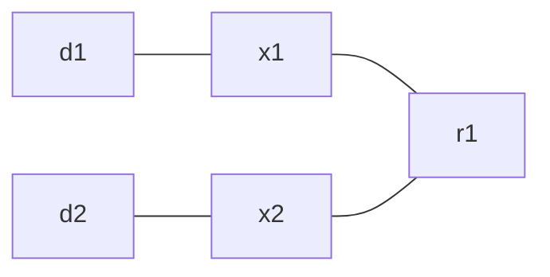
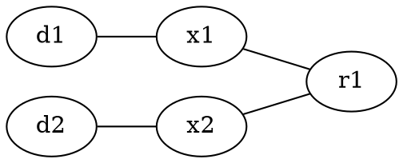
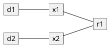
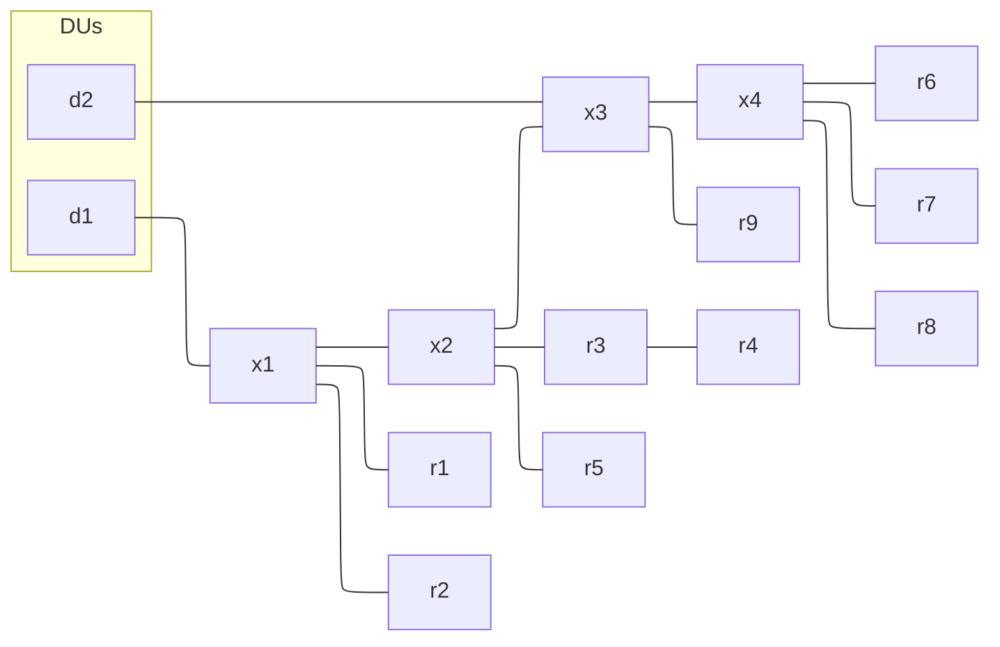
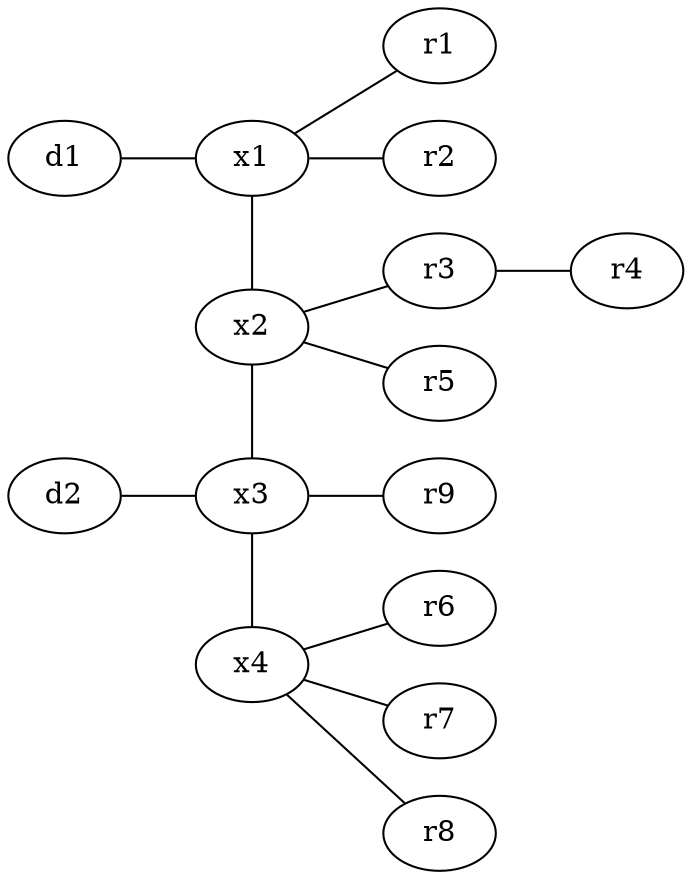
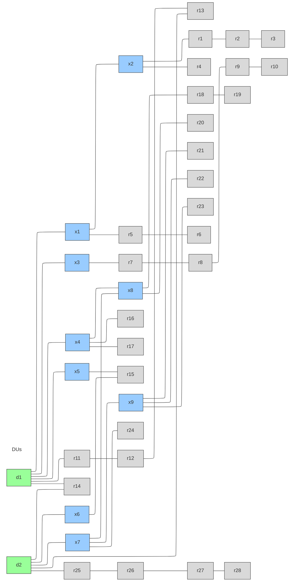
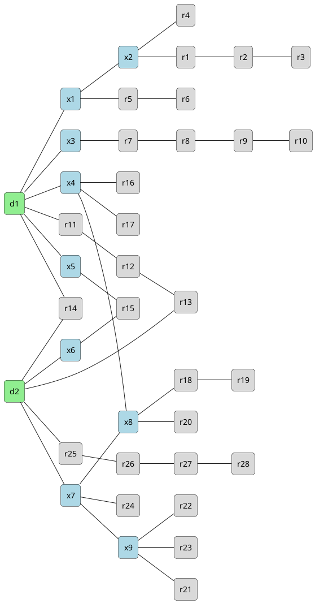

# Adjacency matrix to graphical presentation

Let us have an adjacency matrix of the following form

$$\begin{array}{c|c c c c c c c c c}
        & d1 & \ldots & dn  & x1 & \ldots & xn & r1 & \ldots & rn \\
d1      & 0  & \ldots & 0   & 0  & \ldots & 0  & 0  & \ldots & 0 \\
\vdots  & 0  & \ldots & 0   & 0  & \ldots & 0  & 0  & \ldots & 0 \\
dn      & 0  & \ldots & 0   & 0  & \ldots & 0  & 0  & \ldots & 0 \\
x1      & 0  & \ldots & 0   & 0  & \ldots & 0  & 0  & \ldots & 0 \\
\vdots  & 0  & \ldots & 0   & 0  & \ldots & 0  & 0  & \ldots & 0 \\
xn      & 0  & \ldots & 0   & 0  & \ldots & 0  & 0  & \ldots & 0 \\
r1      & 0  & \ldots & 0   & 0  & \ldots & 0  & 0  & \ldots & 0 \\
\vdots  & 0  & \ldots & 0   & 0  & \ldots & 0  & 0  & \ldots & 0 \\
r1      & 0  & \ldots & 0   & 0  & \ldots & 0  & 0  & \ldots & 0
\end{array}$$

where currently everything is zero. But if a unit is connected to another unit (direction irrelevant), then it would be a $1$.

### An example

1 DU, 1 RU. The radio is not connected to itself, and the DU is not connected to itself.

$$\begin{array}{c|c c}
     & d1 & r1 \\
d1  & 0   & 1  \\
r1  & 1   & 0
\end{array}$$


## Eigenvalues and Eigenvectors of Adjacency Matrices

### Spectral Theorem

Every real symmetric matrix $A$ can be decomposed as:

$$A = Q \Lambda Q^T$$

where:
- $Q$ is an orthogonal matrix whose columns are the eigenvectors of $A$
- $\Lambda$ is a diagonal matrix of the corresponding eigenvalues

Since our adjacency matrix is symmetric ($a_{ij} = a_{ji}$ for undirected graphs), the Spectral Theorem guarantees:
1. All eigenvalues are real
2. Eigenvectors corresponding to distinct eigenvalues are orthogonal
3. The matrix is always diagonalizable
4. An orthonormal basis of eigenvectors exists

### Diagonalizability

A matrix $A$ is diagonalizable if it can be written as:

$$A = P D P^{-1}$$

where $D$ is a diagonal matrix (eigenvalues on the diagonal) and $P$ is an invertible matrix (eigenvectors as columns). An $n \times n$ matrix is diagonalizable if and only if it has $n$ linearly independent eigenvectors. Symmetric matrices are always diagonalizable.

### Interpretation for Network Topologies

**Eigenvalues** represent:
- **Connectivity strength** — the largest eigenvalue (spectral radius) indicates how well-connected the network is
- **Number of walks** — the $(i,j)$ entry of $A^k$ counts walks of length $k$ between nodes $i$ and $j$, and eigenvalues determine how fast this grows
- **Bottlenecks** — the second-smallest eigenvalue of the related Laplacian matrix (algebraic connectivity) tells how easy it is to partition the network

**Eigenvectors** represent:
- **Centrality** — the eigenvector corresponding to the largest eigenvalue gives each node an importance score (eigenvector centrality). Nodes connected to many well-connected nodes score higher
- **Community structure** — eigenvectors corresponding to smaller eigenvalues reveal clusters/partitions in the network. Nodes with similar eigenvector components tend to belong to the same group


## Create separate configurations and then connect

Given two separate adjacency matrices:

- Matrix $A$: $n_A \times n_A$ (DU1 + its switches + its radios)
- Matrix $B$: $n_B \times n_B$ (DU2 + its switches + its radios)

Before connecting them, they form a **block-diagonal** matrix — a 2×2 matrix of blocks:

$$\begin{pmatrix} A & 0 \\ 0 & B \end{pmatrix}$$

- $A$ in position (1,1): the first network's internal connections
- $B$ in position (2,2): the second network's internal connections
- Zero matrices in (1,2) and (2,1): no connections between the two networks

Each block is itself a full adjacency matrix. The two networks are isolated graphs sitting inside one combined matrix.

### Adding a common switch

To connect both DUs to a shared switch $x_{common}$, add 1 row and 1 column:

$$(n_A + n_B + 1) \times (n_A + n_B + 1)$$

$$\begin{array}{c|c|c|c}
 & A_{nodes} & B_{nodes} & x_{common} \\ \hline
A_{nodes} & A & 0 & \text{links to } x_{common} \\ \hline
B_{nodes} & 0 & B & \text{links to } x_{common} \\ \hline
x_{common} & \text{links from A} & \text{links from B} & 0
\end{array}$$

The off-diagonal blocks that were all zeros now have entries through the common switch — that merges the two separate networks into one connected topology.

### Connecting existing nodes across A and B

If instead you connect a node already in B to a node already in A, no new rows or columns are needed. You simply place a 1 in the off-diagonal blocks:

$$\begin{pmatrix} A & C \\ C^T & B \end{pmatrix}$$

Where $C$ contains 1s at positions corresponding to cross-connections between A's nodes and B's nodes. The matrix size stays $(n_A + n_B) \times (n_A + n_B)$ — you're just filling in entries that were previously zero.

## Adjacency List vs Sparse Matrix

| | Adjacency List | Sparse Matrix (COO/CSR) |
|---|---|---|
| **Best for** | Graph traversal (BFS, DFS, finding neighbors) | Linear algebra (eigenvalues, matrix multiplication) |
| **"Get neighbors of x"** | O(1) lookup | Requires scanning entries |
| **"Are x and y connected?"** | O(degree) | O(nnz) for COO, O(log n) for CSR |
| **Memory** | Same — both store only edges | Same |
| **Adding edges** | Easy (append to list) | Easy for COO, expensive for CSR |
| **Library support** | networkx, igraph | numpy, scipy, MATLAB |
| **Human readability** | More intuitive | More compact |

**Recommendation for network topology configuration:**

- Asking "what's connected to this switch?" → adjacency list
- Computing eigenvalues, centrality, or matrix math → sparse matrix (CSR)
- Both → use adjacency list as source of truth, convert to sparse matrix for computation

For networks up to 157 nodes, either works fine performance-wise. The adjacency list is more natural for configuration and validation tasks.


## Storing and Identifying Unique Configurations

When generating millions of configurations, each must be stored efficiently and tagged uniquely.

### Storage Format

Sparse matrix (COO, sorted upper triangle) is preferred for bulk storage:
- Fixed structure per entry — easy to serialize, index, and compare
- Compact footprint per configuration
- Directly hashable for uniqueness checks

### Uniqueness and Canonical Form

Two matrices can represent the same topology if interchangeable nodes are swapped. Nodes are interchangeable when they share the same type *and* model (e.g., two DUs of the same model). Nodes of different types or models are never interchangeable.

**Partial canonicalization** avoids the full graph isomorphism problem by only permuting within equivalence classes:

1. Assign each node a signature: (type, model)
2. Group nodes by signature — only nodes within the same group are interchangeable
3. Within each group, sort nodes by their sorted neighbor list
4. Relabel nodes according to this canonical ordering
5. Hash the resulting sorted edge list (e.g., SHA-256)

This is tractable for networks with max 12 DUs, 25 switches, and 120 radios of a few models each — the permutation space within each group is small.

### Database Schema

- **Key**: SHA-256 hash of the canonicalized sorted edge list
- **Value**: the configuration (edge list, metadata, model assignments)
- **Storage**: key-value database (Redis, LevelDB, or SQLite)

Duplicate detection is an O(1) hash lookup per new configuration.


# Various examples

## 2 DUs, 2 switches, 1 radio


$$\begin{array}{c|c c c c c}
     & d1 & d2  & x1 & x2 & r1 \\ \hline
d1  & 0   & 0    & 1   & 0   & 0 \\
d2  & 0   & 0    & 0   & 1   & 0 \\
x1   & 1   & 0    & 0   & 0   & 1 \\
x2   & 0   & 1    & 0   & 0   & 1 \\
r1  & 0   & 0    & 1   & 1   & 0
\end{array}$$

### Topology



```
d1 ──── x1 ──── r1
                  /
d2 ──── x2 ───┘
```

### Mermaid


### Graphviz (DOT)
Render with <code>dot -Tpng \<file.dot\> -o \<output.png\></code>



### PlantUML



### TikZ (LaTeX)

```latex
\begin{tikzpicture}[node distance=2cm, every node/.style={draw, circle}]
    \node (d1) {d1};
    \node (d2) [below of=d1] {d2};
    \node (x1) [right of=d1] {x1};
    \node (x2) [right of=d2] {x2};
    \node (r1) [right of=x1, yshift=-1cm] {r1};
    \draw (d1) -- (x1);
    \draw (d2) -- (x2);
    \draw (x1) -- (r1);
    \draw (x2) -- (r1);
\end{tikzpicture}
```

### Python (networkx + matplotlib)

```python
import networkx as nx
import matplotlib.pyplot as plt

G = nx.Graph()
G.add_edges_from([("d1","x1"),("d2","x2"),("x1","r1"),("x2","r1")])

pos = {"d1":(0,1), "d2":(0,0), "x1":(1,1), "x2":(1,0), "r1":(2,0.5)}
nx.draw(G, pos, with_labels=True, node_color="lightblue", node_size=1500, font_size=12)
plt.savefig("topology.png")
plt.show()
```

## Advanced drawing

$$\begin{array}{c|c c c c c c c c c c c c c c c}
     & d1 & d2  & x1 & x2 & x3 & x4 & r1 & r2 & r3 & r4 & r5 & r6 & r7 & r8 & r9 \\ \hline
d1  & 0   & 0    & 1   & 0   & 0   & 0   & 0   & 0   & 0   & 0   & 0   & 0   & 0   & 0   & 0 \\
d2  & 0   & 0    & 0   & 0   & 1   & 0   & 0   & 0   & 0   & 0   & 0   & 0   & 0   & 0   & 0 \\
x1   & 1   & 0    & 0   & 1   & 0   & 0   & 1   & 1   & 0   & 0   & 0   & 0   & 0   & 0   & 0 \\
x2   & 0   & 0    & 1   & 0   & 1   & 0   & 0   & 0   & 1   & 0   & 1   & 0   & 0   & 0   & 0 \\
x3   & 0   & 1    & 0   & 1   & 0   & 1   & 0   & 0   & 0   & 0   & 0   & 0   & 0   & 0   & 1 \\
x4   & 0   & 0    & 0   & 0   & 1   & 0   & 0   & 0   & 0   & 0   & 0   & 1   & 1   & 1   & 0 \\
r1  & 0   & 0    & 0   & 1   & 0   & 0   & 0   & 0   & 0   & 0   & 0   & 0   & 0   & 0   & 0 \\
r2  & 0   & 0    & 1   & 0   & 0   & 0   & 0   & 0   & 0   & 0   & 0   & 0   & 0   & 0   & 0 \\
r3  & 0   & 0    & 0   & 1   & 0   & 0   & 0   & 0   & 0   & 1   & 0   & 0   & 0   & 0   & 0 \\
r4  & 0   & 0    & 0   & 0   & 0   & 0   & 0   & 0   & 1   & 0   & 0   & 0   & 0   & 0   & 0 \\
r5  & 0   & 0    & 0   & 1   & 0   & 0   & 0   & 0   & 0   & 0   & 0   & 0   & 0   & 0   & 0 \\
r6  & 0   & 0    & 0   & 0   & 0   & 1   & 0   & 0   & 0   & 0   & 0   & 0   & 0   & 0   & 0 \\
r7  & 0   & 0    & 0   & 0   & 0   & 1   & 0   & 0   & 0   & 0   & 0   & 0   & 0   & 0   & 0 \\
r8  & 0   & 0    & 0   & 0   & 0   & 1   & 0   & 0   & 0   & 0   & 0   & 0   & 0   & 0   & 0 \\
r9  & 0   & 0    & 0   & 0   & 1   & 0   & 0   & 0   & 0   & 0   & 0   & 0   & 0   & 0   & 0
\end{array}$$






### Adjacency List

```
d1:  x1
d2:  x3
x1:  d1, x2, r1, r2
x2:  x1, x3, r3, r5
x3:  d2, x2, x4, r9
x4:  x3, r6, r7, r8
r1:  x1
r2:  x1
r3:  x2, r4
r4:  r3
r5:  x2
r6:  x4
r7:  x4
r8:  x4
r9:  x3
```

### Sparse Matrix (COO format)

Row, Column, Value — only non-zero entries from upper triangle:

```
(d1,  x1)  = 1
(d2,  x3)  = 1
(x1,  x2)  = 1
(x1,  r1)  = 1
(x1,  r2)  = 1
(x2,  x3)  = 1
(x2,  r3)  = 1
(x2,  r5)  = 1
(x3,  x4)  = 1
(x3,  r9)  = 1
(x4,  r6)  = 1
(x4,  r7)  = 1
(x4,  r8)  = 1
(r3,  r4)  = 1
```

14 entries vs 225 in the full matrix (94% reduction).

## Worst case scenario


$$\begin{array}{c|c c c c c c c c c c c c c c c}
    & d1 & d2 & x1 & x2 & x3 & x4 & x5 & x6 & x7 & x8 & x9 & r1 & r2 & r3 & r4 & r5 & r6 & r7 & r8 & r9 & r10 & r11 & r12 & r13 & r14 & r15 & r16 & r17 & r18 & r19 & r20 & r21 & r22 & r23 & r24 & r25 & r26 & r27 & r28 \\ \hline
d1  & 0  & 0  & 1  & 0  & 1  & 1  & 1  & 0  & 0  & 0  & 0  & 0  & 0  & 0  & 0  & 0  & 0  & 0  & 0  & 0  & 0   & 1   & 0   & 0   & 1   & 0   & 0   & 0   & 0   & 0   & 0   & 0   & 0   & 0   & 0   & 0   & 0   & 0   & 0   \\
d2  & 0  & 0  & 0  & 0  & 0  & 0  & 0  & 1  & 1  & 0  & 0  & 0  & 0  & 0  & 0  & 0  & 0  & 0  & 0  & 0  & 0   & 0   & 0   & 1   & 1   & 0   & 0   & 0   & 0   & 0   & 0   & 0   & 0   & 0   & 0   & 1   & 0   & 0   & 0   \\
x1  & 1  & 0  & 0  & 1  & 0  & 0  & 0  & 0  & 0  & 0  & 0  & 0  & 0  & 0  & 0  & 1  & 0  & 0  & 0  & 0  & 0   & 0   & 0   & 0   & 0   & 0   & 0   & 0   & 0   & 0   & 0   & 0   & 0   & 0   & 0   & 0   & 0   & 0   & 0   \\
x2  & 0  & 0  & 1  & 0  & 0  & 0  & 0  & 0  & 0  & 0  & 0  & 1  & 0  & 0  & 1  & 0  & 0  & 0  & 0  & 0  & 0   & 0   & 0   & 0   & 0   & 0   & 0   & 0   & 0   & 0   & 0   & 0   & 0   & 0   & 0   & 0   & 0   & 0   & 0   \\
x3  & 1  & 0  & 0  & 0  & 0  & 0  & 0  & 0  & 0  & 0  & 0  & 0  & 0  & 0  & 0  & 0  & 0  & 1  & 0  & 0  & 0   & 0   & 0   & 0   & 0   & 0   & 0   & 0   & 0   & 0   & 0   & 0   & 0   & 0   & 0   & 0   & 0   & 0   & 0   \\
x4  & 1  & 0  & 0  & 0  & 0  & 0  & 0  & 0  & 0  & 1  & 0  & 0  & 0  & 0  & 0  & 0  & 0  & 0  & 0  & 0  & 0   & 0   & 0   & 0   & 0   & 0   & 1   & 1   & 0   & 0   & 0   & 0   & 0   & 0   & 0   & 0   & 0   & 0   & 0   \\
x5  & 1  & 0  & 0  & 0  & 0  & 0  & 0  & 0  & 0  & 0  & 0  & 0  & 0  & 0  & 0  & 0  & 0  & 0  & 0  & 0  & 0   & 0   & 0   & 0   & 0   & 1   & 0   & 0   & 0   & 0   & 0   & 0   & 0   & 0   & 0   & 0   & 0   & 0   & 0   \\
x6  & 0  & 1  & 0  & 0  & 0  & 0  & 0  & 0  & 0  & 0  & 0  & 0  & 0  & 0  & 0  & 0  & 0  & 0  & 0  & 0  & 0   & 0   & 0   & 0   & 0   & 1   & 0   & 0   & 0   & 0   & 0   & 0   & 0   & 0   & 0   & 0   & 0   & 0   & 0   \\
x7  & 0  & 1  & 0  & 0  & 0  & 0  & 0  & 0  & 0  & 1  & 1  & 0  & 0  & 0  & 0  & 0  & 0  & 0  & 0  & 0  & 0   & 0   & 0   & 0   & 0   & 0   & 0   & 0   & 0   & 0   & 0   & 0   & 0   & 0   & 1   & 0   & 0   & 0   & 0   \\
x8  & 0  & 0  & 0  & 0  & 0  & 1  & 0  & 0  & 1  & 0  & 0  & 0  & 0  & 0  & 0  & 0  & 0  & 0  & 0  & 0  & 0   & 0   & 0   & 0   & 0   & 0   & 0   & 0   & 1   & 0   & 1   & 0   & 0   & 0   & 0   & 0   & 0   & 0   & 0   \\
x9  & 0  & 0  & 0  & 0  & 0  & 0  & 0  & 0  & 1  & 0  & 0  & 0  & 0  & 0  & 0  & 0  & 0  & 0  & 0  & 0  & 0   & 0   & 0   & 0   & 0   & 0   & 0   & 0   & 0   & 0   & 0   & 1   & 1   & 1   & 0   & 0   & 0   & 0   & 0   \\
r1  & 0  & 0  & 0  & 1  & 0  & 0  & 0  & 0  & 0  & 0  & 0  & 0  & 1  & 0  & 0  & 0  & 0  & 0  & 0  & 0  & 0   & 0   & 0   & 0   & 0   & 0   & 0   & 0   & 0   & 0   & 0   & 0   & 0   & 0   & 0   & 0   & 0   & 0   & 0   \\
r2  & 0  & 0  & 0  & 0  & 0  & 0  & 0  & 0  & 0  & 0  & 0  & 1  & 0  & 1  & 0  & 0  & 0  & 0  & 0  & 0  & 0   & 0   & 0   & 0   & 0   & 0   & 0   & 0   & 0   & 0   & 0   & 0   & 0   & 0   & 0   & 0   & 0   & 0   & 0   \\
r3  & 0  & 0  & 0  & 0  & 0  & 0  & 0  & 0  & 0  & 0  & 0  & 0  & 1  & 0  & 0  & 0  & 0  & 0  & 0  & 0  & 0   & 0   & 0   & 0   & 0   & 0   & 0   & 0   & 0   & 0   & 0   & 0   & 0   & 0   & 0   & 0   & 0   & 0   & 0   \\
r4  & 0  & 0  & 0  & 1  & 0  & 0  & 0  & 0  & 0  & 0  & 0  & 0  & 0  & 0  & 0  & 0  & 0  & 0  & 0  & 0  & 0   & 0   & 0   & 0   & 0   & 0   & 0   & 0   & 0   & 0   & 0   & 0   & 0   & 0   & 0   & 0   & 0   & 0   & 0   \\
r5  & 0  & 0  & 1  & 0  & 0  & 0  & 0  & 0  & 0  & 0  & 0  & 0  & 0  & 0  & 0  & 0  & 1  & 0  & 0  & 0  & 0   & 0   & 0   & 0   & 0   & 0   & 0   & 0   & 0   & 0   & 0   & 0   & 0   & 0   & 0   & 0   & 0   & 0   & 0   \\
r6  & 0  & 0  & 0  & 0  & 0  & 0  & 0  & 0  & 0  & 0  & 0  & 0  & 0  & 0  & 0  & 1  & 0  & 0  & 0  & 0  & 0   & 0   & 0   & 0   & 0   & 0   & 0   & 0   & 0   & 0   & 0   & 0   & 0   & 0   & 0   & 0   & 0   & 0   & 0   \\
r7  & 0  & 0  & 0  & 0  & 1  & 0  & 0  & 0  & 0  & 0  & 0  & 0  & 0  & 0  & 0  & 0  & 0  & 0  & 1  & 0  & 0   & 0   & 0   & 0   & 0   & 0   & 0   & 0   & 0   & 0   & 0   & 0   & 0   & 0   & 0   & 0   & 0   & 0   & 0   \\
r8  & 0  & 0  & 0  & 0  & 0  & 0  & 0  & 0  & 0  & 0  & 0  & 0  & 0  & 0  & 0  & 0  & 0  & 1  & 0  & 1  & 0   & 0   & 0   & 0   & 0   & 0   & 0   & 0   & 0   & 0   & 0   & 0   & 0   & 0   & 0   & 0   & 0   & 0   & 0   \\
r9  & 0  & 0  & 0  & 0  & 0  & 0  & 0  & 0  & 0  & 0  & 0  & 0  & 0  & 0  & 0  & 0  & 0  & 0  & 1  & 0  & 1   & 0   & 0   & 0   & 0   & 0   & 0   & 0   & 0   & 0   & 0   & 0   & 0   & 0   & 0   & 0   & 0   & 0   & 0   \\
r10 & 0  & 0  & 0  & 0  & 0  & 0  & 0  & 0  & 0  & 0  & 0  & 0  & 0  & 0  & 0  & 0  & 0  & 0  & 0  & 1  & 0   & 0   & 0   & 0   & 0   & 0   & 0   & 0   & 0   & 0   & 0   & 0   & 0   & 0   & 0   & 0   & 0   & 0   & 0   \\
r11 & 1  & 0  & 0  & 0  & 0  & 0  & 0  & 0  & 0  & 0  & 0  & 0  & 0  & 0  & 0  & 0  & 0  & 0  & 0  & 0  & 0   & 0   & 1   & 0   & 0   & 0   & 0   & 0   & 0   & 0   & 0   & 0   & 0   & 0   & 0   & 0   & 0   & 0   & 0   \\
r12 & 0  & 0  & 0  & 0  & 0  & 0  & 0  & 0  & 0  & 0  & 0  & 0  & 0  & 0  & 0  & 0  & 0  & 0  & 0  & 0  & 0   & 1   & 0   & 1   & 0   & 0   & 0   & 0   & 0   & 0   & 0   & 0   & 0   & 0   & 0   & 0   & 0   & 0   & 0   \\
r13 & 0  & 1  & 0  & 0  & 0  & 0  & 0  & 0  & 0  & 0  & 0  & 0  & 0  & 0  & 0  & 0  & 0  & 0  & 0  & 0  & 0   & 0   & 1   & 0   & 0   & 0   & 0   & 0   & 0   & 0   & 0   & 0   & 0   & 0   & 0   & 0   & 0   & 0   & 0   \\
r14 & 1  & 1  & 0  & 0  & 0  & 0  & 0  & 0  & 0  & 0  & 0  & 0  & 0  & 0  & 0  & 0  & 0  & 0  & 0  & 0  & 0   & 0   & 0   & 0   & 0   & 0   & 0   & 0   & 0   & 0   & 0   & 0   & 0   & 0   & 0   & 0   & 0   & 0   & 0   \\
r15 & 0  & 0  & 0  & 0  & 0  & 0  & 1  & 1  & 0  & 0  & 0  & 0  & 0  & 0  & 0  & 0  & 0  & 0  & 0  & 0  & 0   & 0   & 0   & 0   & 0   & 0   & 0   & 0   & 0   & 0   & 0   & 0   & 0   & 0   & 0   & 0   & 0   & 0   & 0   \\
r16 & 0  & 0  & 0  & 0  & 0  & 1  & 0  & 0  & 0  & 0  & 0  & 0  & 0  & 0  & 0  & 0  & 0  & 0  & 0  & 0  & 0   & 0   & 0   & 0   & 0   & 0   & 0   & 0   & 0   & 0   & 0   & 0   & 0   & 0   & 0   & 0   & 0   & 0   & 0   \\
r17 & 0  & 0  & 0  & 0  & 0  & 1  & 0  & 0  & 0  & 0  & 0  & 0  & 0  & 0  & 0  & 0  & 0  & 0  & 0  & 0  & 0   & 0   & 0   & 0   & 0   & 0   & 0   & 0   & 0   & 0   & 0   & 0   & 0   & 0   & 0   & 0   & 0   & 0   & 0   \\
r18 & 0  & 0  & 0  & 0  & 0  & 0  & 0  & 0  & 0  & 1  & 0  & 0  & 0  & 0  & 0  & 0  & 0  & 0  & 0  & 0  & 0   & 0   & 0   & 0   & 0   & 0   & 0   & 0   & 0   & 1   & 0   & 0   & 0   & 0   & 0   & 0   & 0   & 0   & 0   \\
r19 & 0  & 0  & 0  & 0  & 0  & 0  & 0  & 0  & 0  & 0  & 0  & 0  & 0  & 0  & 0  & 0  & 0  & 0  & 0  & 0  & 0   & 0   & 0   & 0   & 0   & 0   & 0   & 0   & 1   & 0   & 0   & 0   & 0   & 0   & 0   & 0   & 0   & 0   & 0   \\
r20 & 0  & 0  & 0  & 0  & 0  & 0  & 0  & 0  & 0  & 1  & 0  & 0  & 0  & 0  & 0  & 0  & 0  & 0  & 0  & 0  & 0   & 0   & 0   & 0   & 0   & 0   & 0   & 0   & 0   & 0   & 0   & 0   & 0   & 0   & 0   & 0   & 0   & 0   & 0   \\
r21 & 0  & 0  & 0  & 0  & 0  & 0  & 0  & 0  & 0  & 0  & 1  & 0  & 0  & 0  & 0  & 0  & 0  & 0  & 0  & 0  & 0   & 0   & 0   & 0   & 0   & 0   & 0   & 0   & 0   & 0   & 0   & 0   & 0   & 0   & 0   & 0   & 0   & 0   & 0   \\
r22 & 0  & 0  & 0  & 0  & 0  & 0  & 0  & 0  & 0  & 0  & 1  & 0  & 0  & 0  & 0  & 0  & 0  & 0  & 0  & 0  & 0   & 0   & 0   & 0   & 0   & 0   & 0   & 0   & 0   & 0   & 0   & 0   & 0   & 0   & 0   & 0   & 0   & 0   & 0   \\
r23 & 0  & 0  & 0  & 0  & 0  & 0  & 0  & 0  & 0  & 0  & 1  & 0  & 0  & 0  & 0  & 0  & 0  & 0  & 0  & 0  & 0   & 0   & 0   & 0   & 0   & 0   & 0   & 0   & 0   & 0   & 0   & 0   & 0   & 0   & 0   & 0   & 0   & 0   & 0   \\
r24 & 0  & 0  & 0  & 0  & 0  & 0  & 0  & 0  & 1  & 0  & 0  & 0  & 0  & 0  & 0  & 0  & 0  & 0  & 0  & 0  & 0   & 0   & 0   & 0   & 0   & 0   & 0   & 0   & 0   & 0   & 0   & 0   & 0   & 0   & 0   & 0   & 0   & 0   & 0   \\
r25 & 0  & 1  & 0  & 0  & 0  & 0  & 0  & 0  & 0  & 0  & 0  & 0  & 0  & 0  & 0  & 0  & 0  & 0  & 0  & 0  & 0   & 0   & 0   & 0   & 0   & 0   & 0   & 0   & 0   & 0   & 0   & 0   & 0   & 0   & 0   & 0   & 1   & 0   & 0   \\
r26 & 0  & 0  & 0  & 0  & 0  & 0  & 0  & 0  & 0  & 0  & 0  & 0  & 0  & 0  & 0  & 0  & 0  & 0  & 0  & 0  & 0   & 0   & 0   & 0   & 0   & 0   & 0   & 0   & 0   & 0   & 0   & 0   & 0   & 0   & 0   & 1   & 0   & 1   & 0   \\
r27 & 0  & 0  & 0  & 0  & 0  & 0  & 0  & 0  & 0  & 0  & 0  & 0  & 0  & 0  & 0  & 0  & 0  & 0  & 0  & 0  & 0   & 0   & 0   & 0   & 0   & 0   & 0   & 0   & 0   & 0   & 0   & 0   & 0   & 0   & 0   & 0   & 1   & 0   & 1   \\
r28 & 0  & 0  & 0  & 0  & 0  & 0  & 0  & 0  & 0  & 0  & 0  & 0  & 0  & 0  & 0  & 0  & 0  & 0  & 0  & 0  & 0   & 0   & 0   & 0   & 0   & 0   & 0   & 0   & 0   & 0   & 0   & 0   & 0   & 0   & 0   & 0   & 0   & 1   & 0
\end{array}$$

### Topology



### PlantUML



### Adjacency List

```
d1:   x1, x3, x4, x5, r11, r14
d2:   x6, x7, r13, r14, r25
x1:   d1, x2, r5
x2:   x1, r1, r4
x3:   d1, r7
x4:   d1, x8, r16, r17
x5:   d1, r15
x6:   d2, r15
x7:   d2, x8, x9, r24
x8:   x4, x7, r18, r20
x9:   x7, r21, r22, r23
r1:   x2, r2
r2:   r1, r3
r3:   r2
r4:   x2
r5:   x1, r6
r6:   r5
r7:   x3, r8
r8:   r7, r9
r9:   r8, r10
r10:  r9
r11:  d1, r12
r12:  r11, r13
r13:  d2, r12
r14:  d1, d2
r15:  x5, x6
r16:  x4
r17:  x4
r18:  x8, r19
r19:  r18
r20:  x8
r21:  x9
r22:  x9
r23:  x9
r24:  x7
r25:  d2, r26
r26:  r25, r27
r27:  r26, r28
r28:  r27
```

### Sparse Matrix (COO format)

Upper triangle only:

```
(d1,  x1)  = 1
(d1,  x3)  = 1
(d1,  x4)  = 1
(d1,  x5)  = 1
(d1,  r11) = 1
(d1,  r14) = 1
(d2,  x6)  = 1
(d2,  x7)  = 1
(d2,  r13) = 1
(d2,  r14) = 1
(d2,  r25) = 1
(x1,  x2)  = 1
(x1,  r5)  = 1
(x2,  r1)  = 1
(x2,  r4)  = 1
(x3,  r7)  = 1
(x4,  x8)  = 1
(x4,  r16) = 1
(x4,  r17) = 1
(x5,  r15) = 1
(x6,  r15) = 1
(x7,  x8)  = 1
(x7,  x9)  = 1
(x7,  r24) = 1
(x8,  r18) = 1
(x8,  r20) = 1
(x9,  r21) = 1
(x9,  r22) = 1
(x9,  r23) = 1
(r1,  r2)  = 1
(r2,  r3)  = 1
(r5,  r6)  = 1
(r7,  r8)  = 1
(r8,  r9)  = 1
(r9,  r10) = 1
(r11, r12) = 1
(r12, r13) = 1
(r18, r19) = 1
(r25, r26) = 1
(r26, r27) = 1
(r27, r28) = 1
```

41 entries vs 1521 in the full 39×39 matrix (97% reduction).

